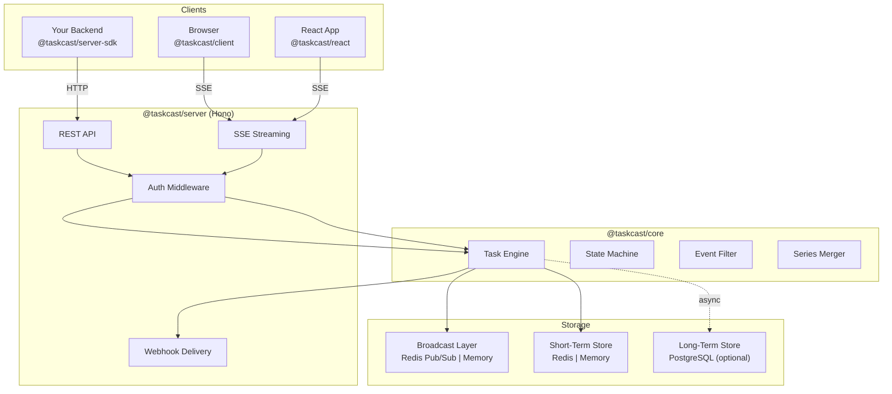
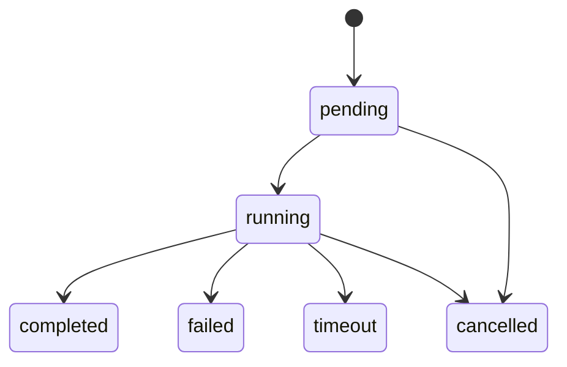

<div align="center">

# Taskcast

**Unified long-lifecycle task tracking service for LLM streaming, agents, and beyond.**

[](https://www.npmjs.com/package/@taskcast/core)
[](./LICENSE)
[](https://www.typescriptlang.org/)
[](https://nodejs.org/)

[English](./README.md) | [中文](./README.zh.md)

</div>

---

Traditional SSE connections lose all state on page refresh. Multiple clients cannot subscribe to the same task stream. Taskcast solves this with a unified task tracking service that provides **persistent state**, **resumable subscriptions**, and **multi-client fan-out** — purpose-built for LLM streaming outputs and agent workflows.

## Highlights

- **Resumable SSE Streaming** — Reconnect from any point using event ID, filtered index, or timestamp. Never lose progress on page refresh.
- **Multi-Client Fan-Out** — Multiple browser tabs, devices, or services subscribe to the same task in real time.
- **Series Message Merging** — Built-in support for streaming text accumulation (`accumulate`), latest-value replacement (`latest`), and full history (`keep-all`).
- **Three-Layer Storage** — Broadcast (Redis pub/sub) + Short-term (Redis) + Long-term (PostgreSQL). Each layer is pluggable and optional.
- **Flexible Authentication** — No auth, JWT, or custom middleware. Fine-grained permission scopes down to individual tasks.
- **SDK-First Architecture** — Zero HTTP dependencies in core. Embed into your existing server or run standalone with `npx taskcast`.

## Architecture



### Deployment Modes

**Embedded** — Import the core engine and mount the Hono router into your existing server:

```
Your Server → @taskcast/core + adapters → @taskcast/server (Hono router)
```

**Standalone** — Run as an independent service, connect via HTTP SDK:

```
Your Server → @taskcast/server-sdk → standalone taskcast server ← @taskcast/client (browser)
```

## Quick Start

### Standalone Server

```bash
npx taskcast
```

The server starts on port `3721` by default. Configure with a config file or environment variables:

```bash
npx taskcast -p 8080 -c taskcast.config.yaml
```

### Embedded Mode

```bash
pnpm add @taskcast/core @taskcast/server
```

```typescript
import { TaskEngine, MemoryBroadcastProvider, MemoryShortTermStore } from '@taskcast/core'
import { createTaskcastApp } from '@taskcast/server'

const engine = new TaskEngine({
  broadcast: new MemoryBroadcastProvider(),
  shortTermStore: new MemoryShortTermStore(),
})

const app = createTaskcastApp({ engine })
// Mount to your existing Hono app or serve directly
export default app
```

## Usage Examples

### Create & Track a Task (Server-Side)

```typescript
// Create a task
const task = await engine.createTask({
  type: 'llm.chat',
  params: { prompt: 'Tell me a story' },
  ttl: 3600,
})

// Transition to running
await engine.transitionTask(task.id, 'running')

// Publish streaming events
await engine.publishEvent(task.id, {
  type: 'llm.delta',
  level: 'info',
  data: { text: 'Once upon a time...' },
  seriesId: 'response',
  seriesMode: 'accumulate',
})

// Complete the task
await engine.transitionTask(task.id, 'completed', {
  result: { output: 'Once upon a time... The End.' },
})
```

### Subscribe from Browser

```typescript
import { TaskcastClient } from '@taskcast/client'

const client = new TaskcastClient({
  baseUrl: 'http://localhost:3721',
  token: 'your-jwt-token', // optional
})

await client.subscribe(taskId, {
  filter: {
    types: ['llm.*'],
    since: { index: 0 },
  },
  onEvent: (envelope) => {
    console.log(envelope.data) // { text: "Once upon a time..." }
  },
  onDone: (reason) => {
    console.log(`Task ${reason}`) // "Task completed"
  },
})
```

### React Integration

```typescript
import { useTaskEvents } from '@taskcast/react'

function TaskStream({ taskId }: { taskId: string }) {
  const { events, isDone, doneReason, error } = useTaskEvents(taskId, {
    baseUrl: 'http://localhost:3721',
    filter: { types: ['llm.*'] },
  })

  return (
    <div>
      {events.map((e) => (
        <span key={e.eventId}>{e.data.text}</span>
      ))}
      {isDone && <p>Done: {doneReason}</p>}
      {error && <p>Error: {error.message}</p>}
    </div>
  )
}
```

## Packages

| Package | Description | Install |
|---------|-------------|---------|
| [`@taskcast/core`](./packages/core) | Task engine — state machine, filtering, series merging. Zero HTTP deps. | `pnpm add @taskcast/core` |
| [`@taskcast/server`](./packages/server) | Hono HTTP server — REST, SSE, auth, webhooks | `pnpm add @taskcast/server` |
| [`@taskcast/server-sdk`](./packages/server-sdk) | HTTP client SDK for remote server mode | `pnpm add @taskcast/server-sdk` |
| [`@taskcast/client`](./packages/client) | Browser SSE subscription client | `pnpm add @taskcast/client` |
| [`@taskcast/react`](./packages/react) | React hooks (`useTaskEvents`) | `pnpm add @taskcast/react` |
| [`@taskcast/cli`](./packages/cli) | Standalone server CLI | `npx taskcast` |
| [`@taskcast/redis`](./packages/redis) | Redis adapters (broadcast + short-term store) | `pnpm add @taskcast/redis` |
| [`@taskcast/postgres`](./packages/postgres) | PostgreSQL adapter (long-term store) | `pnpm add @taskcast/postgres` |
| [`@taskcast/sentry`](./packages/sentry) | Sentry error monitoring hooks | `pnpm add @taskcast/sentry` |

## Configuration

### Config File

Taskcast searches for config files in the current directory:

`taskcast.config.ts` > `.js` > `.mjs` > `.yaml` / `.yml` > `.json`

```yaml
# taskcast.config.yaml
port: 3721
logLevel: info

auth:
  mode: jwt
  jwt:
    algorithm: RS256
    publicKeyFile: /run/secrets/jwt.pub

adapters:
  broadcast:
    provider: redis
    url: ${REDIS_URL}
  shortTerm:
    provider: redis
    url: ${REDIS_URL}
  longTerm:
    provider: postgres
    url: ${DATABASE_URL}

sentry:
  dsn: ${SENTRY_DSN}
  captureTaskFailures: true
  captureTaskTimeouts: true

webhook:
  defaultRetry:
    retries: 3
    backoff: exponential
    initialDelayMs: 1000

cleanup:
  rules:
    - match:
        taskTypes: ["llm.*"]
      trigger:
        afterMs: 3600000
      target: events
    - trigger:
        afterMs: 604800000
      target: all
```

### Environment Variables

| Variable | Description | Default |
|----------|-------------|---------|
| `TASKCAST_PORT` | Server port | `3721` |
| `TASKCAST_AUTH_MODE` | `none` \| `jwt` \| `custom` | `none` |
| `TASKCAST_JWT_SECRET` | JWT HMAC secret | — |
| `TASKCAST_JWT_PUBLIC_KEY_FILE` | Path to JWT public key | — |
| `TASKCAST_REDIS_URL` | Redis connection URL | — |
| `TASKCAST_POSTGRES_URL` | PostgreSQL connection URL | — |
| `TASKCAST_LOG_LEVEL` | `debug` \| `info` \| `warn` \| `error` | `info` |
| `SENTRY_DSN` | Sentry error tracking DSN | — |

## API Overview

### REST Endpoints

| Method | Path | Description |
|--------|------|-------------|
| `POST` | `/tasks` | Create a task |
| `GET` | `/tasks/:taskId` | Get task status and metadata |
| `PATCH` | `/tasks/:taskId/status` | Transition task status |
| `DELETE` | `/tasks/:taskId` | Delete a task |
| `POST` | `/tasks/:taskId/events` | Publish event(s) |
| `GET` | `/tasks/:taskId/events` | Subscribe via SSE |
| `GET` | `/tasks/:taskId/events/history` | Query event history |

### SSE Query Parameters

| Parameter | Description | Example |
|-----------|-------------|---------|
| `since.id` | Resume after event ID | `since.id=01HXXX` |
| `since.index` | Resume after filtered index | `since.index=5` |
| `since.timestamp` | Resume after timestamp | `since.timestamp=1700000` |
| `types` | Filter event types (wildcard) | `types=llm.*,tool.call` |
| `levels` | Filter event levels | `levels=info,warn` |
| `includeStatus` | Include status events | `includeStatus=true` |
| `wrap` | Wrap in envelope | `wrap=true` |

### Task Status Lifecycle



### Permission Scopes

| Scope | Description |
|-------|-------------|
| `task:create` | Create new tasks |
| `task:manage` | Change task status, delete tasks |
| `event:publish` | Publish events to tasks |
| `event:subscribe` | Subscribe to task SSE streams |
| `event:history` | Query event history |
| `webhook:create` | Create webhook configurations |
| `*` | Full access |

## Development

```bash
# Install dependencies
pnpm install

# Build all packages
pnpm build

# Run tests
pnpm test

# Run tests in watch mode
pnpm test:watch

# Run tests with coverage
pnpm test:coverage

# Type check
pnpm lint
```

## Contributing

Contributions are welcome! Please feel free to submit issues and pull requests.

1. Fork the repository
2. Create your feature branch (`git checkout -b feat/amazing-feature`)
3. Commit your changes (`git commit -m 'feat: add amazing feature'`)
4. Push to the branch (`git push origin feat/amazing-feature`)
5. Open a Pull Request

## License

[MIT](./LICENSE)
