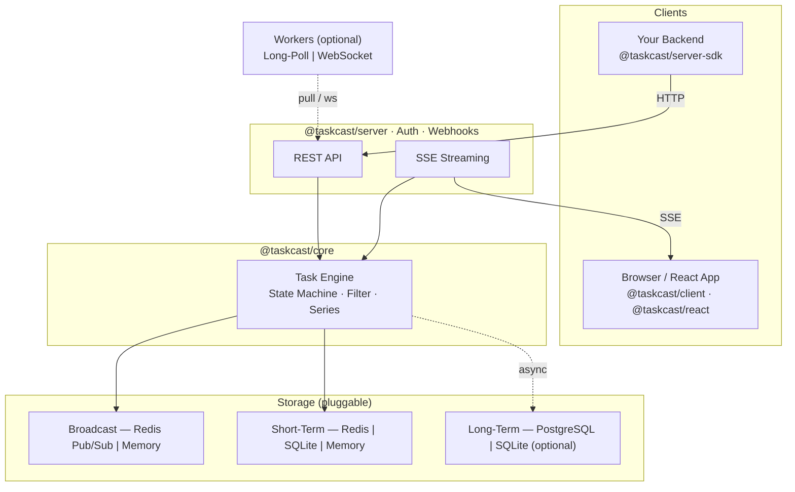
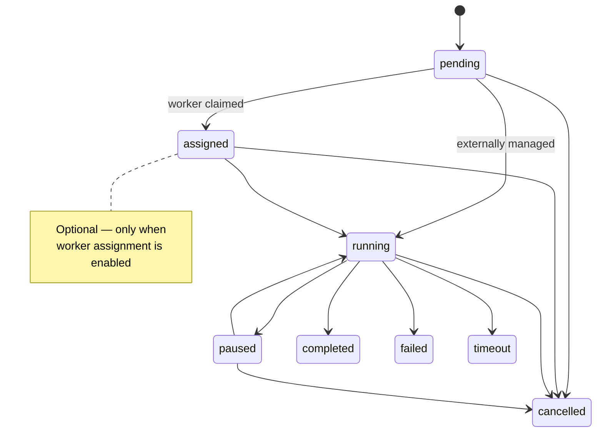

<div align="center">

# Taskcast

**Simple mental model. Out-of-the-box task tracking for LLM streaming, agents, and async workloads.**

[](https://www.npmjs.com/package/@taskcast/core)
[](https://hub.docker.com/r/mwr1998/taskcast)
[](https://hub.docker.com/r/mwr1998/taskcast-rs)
[](./LICENSE)
[](https://www.typescriptlang.org/)
[](https://nodejs.org/)
[]()

[Getting Started](./docs/guide/getting-started.md) | [Core Concepts](./docs/guide/concepts.md) | [REST API](./docs/api/rest.md) | [SSE](./docs/api/sse.md) | [Deployment](./docs/guide/deployment.md)

[English](./README.md) | [中文](./README.zh.md)

</div>

---

Create a task, publish events, subscribe — that's the whole mental model. Yet Taskcast ships everything out of the box: **persistent state**, **resumable subscriptions**, **multi-client fan-out**, **optional worker management**, and a pluggable storage stack from a single SQLite file to Redis + PostgreSQL. Purpose-built for LLM streaming outputs and agent workflows.

## Highlights

- **Resumable SSE Streaming** — Reconnect from any point using event ID, filtered index, or timestamp. Never lose progress on page refresh.
- **Multi-Client Fan-Out** — Multiple browser tabs, devices, or services subscribe to the same task in real time.
- **Series Message Merging** — Built-in support for streaming text accumulation (`accumulate`, default field follows ChatCompletion delta format), latest-value replacement (`latest`), and full history (`keep-all`).
- **Three-Layer Storage** — Broadcast (Redis pub/sub | Memory) + Short-term (Redis | SQLite | Memory) + Long-term (PostgreSQL | SQLite). Each layer is pluggable and independently optional.
- **Worker Management** *(optional)* — Built-in task assignment with pull (long-poll) and WebSocket (offer/race) modes. Capacity tracking, matching rules, and automatic reassignment on disconnect.
- **Rust Server** — Drop-in native binary (`taskcast-rs`) for optimal performance and minimal resource usage. Same API, same behavior, zero Node.js dependency.
- **Flexible Authentication** — No auth, JWT, or custom middleware. Fine-grained permission scopes down to individual tasks.
- **SDK-First Architecture** — Zero HTTP dependencies in core. Embed into your existing server or run standalone with `npx @taskcast/cli`.

## Architecture


```mermaid
graph TB
    subgraph Clients
        Browser["Browser / React App<br/>@taskcast/client · @taskcast/react"]
        Backend["Your Backend<br/>@taskcast/server-sdk"]
    end

    Workers["Workers (optional)<br/>Long-Poll | WebSocket"]

    subgraph Server["@taskcast/server · Auth · Webhooks"]
        REST["REST API"]
        SSE["SSE Streaming"]
    end

    subgraph Core["@taskcast/core"]
        Engine["Task Engine<br/>State Machine · Filter · Series"]
    end

    subgraph Storage["Storage (pluggable)"]
        Broadcast["Broadcast — Redis Pub/Sub | Memory"]
        ShortTerm["Short-Term — Redis | SQLite | Memory"]
        LongTerm["Long-Term — PostgreSQL | SQLite (optional)"]
    end

    SSE -->|SSE| Browser
    Backend -->|HTTP| REST
    Workers -.->|pull / ws| REST
    REST --> Engine
    SSE --> Engine
    Engine --> Broadcast
    Engine --> ShortTerm
    Engine -.->|async| LongTerm
```

### Deployment Modes

**Embedded** — Import the core engine and mount the Hono router into your existing server:

```
Your Server → @taskcast/core + adapters → @taskcast/server (Hono router)
```

**Remote (Recommended)** — Run as an independent microservice, connect via RESTful API. Clean service boundary, independently scalable. Docker ready.

```
Your Server → @taskcast/server-sdk (REST) → taskcast service ← @taskcast/client (browser)
```

## Quick Start

### Standalone Server

**Node.js (npx):**

```bash
npx @taskcast/cli
```

**Native Rust binary:**

```bash
# Homebrew (macOS / Linux)
brew tap weightwave/tap
brew install taskcast
taskcast-rs

# Or download a pre-built binary from GitHub Releases
# https://github.com/weightwave/taskcast/releases

# Or run via Docker
docker run -p 3721:3721 mwr1998/taskcast-rs
```

The server starts on port `3721` by default. Configure with a config file or environment variables:

```bash
npx @taskcast/cli -p 8080 -c taskcast.config.yaml
# or
taskcast-rs -p 8080 -c taskcast.config.yaml
```

### Embedded Mode

```bash
pnpm add @taskcast/core @taskcast/server
```

```typescript
import { TaskEngine, MemoryBroadcastProvider, MemoryShortTermStore } from '@taskcast/core'
import { createTaskcastApp } from '@taskcast/server'

const engine = new TaskEngine({
  broadcast: new MemoryBroadcastProvider(),
  shortTermStore: new MemoryShortTermStore(),
})

const app = createTaskcastApp({ engine })
// Mount to your existing Hono app or serve directly
export default app
```

## Usage Examples

### Pattern 1: Backend + Worker Integrated (Self-Managed)

The backend creates tasks, processes them directly, and streams results — all within the same process. No separate worker needed.

```typescript
import { TaskEngine, MemoryBroadcastProvider, MemoryShortTermStore } from '@taskcast/core'
import { createTaskcastApp } from '@taskcast/server'
import { Hono } from 'hono'

// Create the task engine with in-memory adapters (swap to Redis/SQLite for production)
const engine = new TaskEngine({
  broadcast: new MemoryBroadcastProvider(),   // real-time event fan-out to all SSE subscribers
  shortTermStore: new MemoryShortTermStore(), // task state + event buffer (sync writes ensure ordering)
})

const app = new Hono()
// Mount the Taskcast HTTP routes — provides REST API + SSE endpoints under /taskcast
app.route('/taskcast', createTaskcastApp({ engine }))

// Your API endpoint — creates and handles tasks directly
app.post('/api/chat', async (c) => {
  const { prompt } = await c.req.json()

  // Create a task in "pending" status. The client can start subscribing immediately —
  // SSE will hold the connection and auto-stream once the task transitions to "running".
  const task = await engine.createTask({
    type: 'llm.chat',       // task type, used for event filtering (supports wildcards like "llm.*")
    params: { prompt },      // arbitrary params, passed through to consumers
    ttl: 600,                // auto-timeout after 10 minutes if not completed
  })

  // Process in background — this server IS the worker.
  // The client receives the taskId immediately and subscribes via SSE.
  processChat(task.id, prompt)
  return c.json({ taskId: task.id })
})

async function processChat(taskId: string, prompt: string) {
  // pending → running: SSE subscribers waiting on this task will start receiving events
  await engine.transitionTask(taskId, 'running')

  for await (const chunk of callLLM(prompt)) {
    // Publish a streaming event. seriesMode: 'accumulate' means the engine merges
    // all deltas into a single series entry (like ChatCompletion streaming).
    // Late-joining subscribers see the accumulated result, not individual chunks.
    await engine.publishEvent(taskId, {
      type: 'llm.delta',
      level: 'info',
      data: { delta: chunk },
      seriesId: 'response',       // groups events into a named series
      seriesMode: 'accumulate',   // 'accumulate' | 'latest' | 'keep-all'
    })
  }

  // running → completed: SSE connections receive the completion event and close automatically.
  // Only one terminal transition is allowed (concurrent-safe).
  await engine.transitionTask(taskId, 'completed', {
    result: { output: 'full response text' },
  })
}
```

The client subscribes to `GET /taskcast/tasks/{taskId}/events` (SSE) to receive streamed results. If the task is still `pending`, the connection holds and auto-streams when it transitions to `running`. If the task is already `completed`, the client receives the full history replay then closes.

### Pattern 2: Backend + Worker Separated

The backend creates tasks via the HTTP SDK. Independent worker processes connect to the Taskcast service and pick up tasks for processing.

**Backend (task producer):**

```typescript
import { TaskcastServerClient } from '@taskcast/server-sdk'

const taskcast = new TaskcastServerClient({
  baseUrl: 'http://taskcast-service:3721',
  token: process.env.TASKCAST_TOKEN, // JWT with task:create + event:subscribe scopes
})

// Create a task — it stays in "pending" until a worker picks it up.
// assignMode tells the engine how to distribute this task to workers.
const task = await taskcast.createTask({
  type: 'llm.chat',
  params: { prompt: 'Tell me a story' },
  assignMode: 'pull',    // 'pull' = worker long-polls; 'ws-offer' = server pushes to WS worker;
                         // 'ws-race' = server offers to multiple WS workers, first accept wins
})

// Return taskId to the client — they subscribe via SSE to receive streaming results
return { taskId: task.id }
```

**Worker — Pull mode (long-polling):**

```typescript
const TASKCAST_URL = 'http://taskcast-service:3721'
const WORKER_ID = 'worker-1'

async function workerLoop() {
  while (true) {
    // Long-poll: the server holds the connection until a matching task is available
    // or the timeout expires. On match, the task is atomically assigned to this worker
    // (pending → assigned) so no other worker can claim it.
    const res = await fetch(
      `${TASKCAST_URL}/workers/pull?workerId=${WORKER_ID}&timeout=30000`,
      { headers: { Authorization: `Bearer ${WORKER_TOKEN}` } },
    )

    if (res.status === 204) continue // timeout, no task matched — retry

    const task = await res.json() // { id, type, params, ... }
    await processAndComplete(task.id, task.params)
  }
}

async function processAndComplete(taskId: string, params: Record<string, unknown>) {
  // assigned → running: tells subscribers that processing has started
  await fetch(`${TASKCAST_URL}/tasks/${taskId}/status`, {
    method: 'PATCH',
    headers: { 'Content-Type': 'application/json', Authorization: `Bearer ${WORKER_TOKEN}` },
    body: JSON.stringify({ status: 'running' }),
  })

  // Publish streaming events — each event is broadcast to all SSE subscribers in real time.
  // seriesMode: 'accumulate' merges deltas so late-joiners see the full text so far.
  for await (const chunk of callLLM(params.prompt as string)) {
    await fetch(`${TASKCAST_URL}/tasks/${taskId}/events`, {
      method: 'POST',
      headers: { 'Content-Type': 'application/json', Authorization: `Bearer ${WORKER_TOKEN}` },
      body: JSON.stringify({
        type: 'llm.delta', level: 'info',
        data: { delta: chunk },
        seriesId: 'response', seriesMode: 'accumulate',
      }),
    })
  }

  // running → completed: SSE subscribers receive the terminal event and disconnect.
  // The worker's capacity slot is automatically freed for the next task.
  await fetch(`${TASKCAST_URL}/tasks/${taskId}/status`, {
    method: 'PATCH',
    headers: { 'Content-Type': 'application/json', Authorization: `Bearer ${WORKER_TOKEN}` },
    body: JSON.stringify({ status: 'completed', result: { output: 'full text' } }),
  })
}
```

**Worker — WebSocket mode:**

```typescript
const ws = new WebSocket('ws://taskcast-service:3721/workers/ws')

ws.addEventListener('open', () => {
  // Register this worker with the server. matchRule filters which tasks
  // are offered to this worker; capacity limits concurrent assignments.
  ws.send(JSON.stringify({
    type: 'register',
    matchRule: { types: ['llm.*'] }, // only accept tasks with type matching "llm.*"
    capacity: 5,                     // max 5 concurrent tasks
  }))
})

ws.addEventListener('message', async (event) => {
  const msg = JSON.parse(event.data)

  if (msg.type === 'offer') {
    // Server offers a task to this worker (ws-offer mode: exclusive offer;
    // ws-race mode: offered to multiple workers, first accept wins).
    // msg.task contains { id, type, params, tags, cost }.
    ws.send(JSON.stringify({ type: 'accept', taskId: msg.task.id }))
    await processAndComplete(msg.task.id, msg.task.params)
  }
})
```

**Client (browser):**

```typescript
import { TaskcastClient } from '@taskcast/client'

const client = new TaskcastClient({
  baseUrl: 'http://taskcast-service:3721', // or behind an API gateway that handles auth
  token: 'user-jwt-token',
})

await client.subscribe(taskId, {
  filter: { types: ['llm.*'] },
  onEvent: (envelope) => {
    console.log(envelope.data.delta) // streamed chunks
  },
  onDone: (reason) => {
    console.log('Task completed:', reason)
  },
})
```

## Packages

| Package | Description | Install |
|---------|-------------|---------|
| [`@taskcast/core`](./packages/core) | Task engine — state machine, filtering, series merging. Zero HTTP deps. | `pnpm add @taskcast/core` |
| [`@taskcast/server`](./packages/server) | Hono HTTP server — REST, SSE, auth, webhooks | `pnpm add @taskcast/server` |
| [`@taskcast/server-sdk`](./packages/server-sdk) | HTTP client SDK for remote server mode | `pnpm add @taskcast/server-sdk` |
| [`@taskcast/client`](./packages/client) | Browser SSE subscription client | `pnpm add @taskcast/client` |
| [`@taskcast/react`](./packages/react) | React hooks (`useTaskEvents`) | `pnpm add @taskcast/react` |
| [`@taskcast/cli`](./packages/cli) | Standalone server CLI | `npx @taskcast/cli` |
| [`@taskcast/sqlite`](./packages/sqlite) | SQLite adapter (short-term + long-term store) | `pnpm add @taskcast/sqlite` |
| [`@taskcast/redis`](./packages/redis) | Redis adapters (broadcast + short-term store) | `pnpm add @taskcast/redis` |
| [`@taskcast/postgres`](./packages/postgres) | PostgreSQL adapter (long-term store) | `pnpm add @taskcast/postgres` |
| [`@taskcast/sentry`](./packages/sentry) | Sentry error monitoring hooks | `pnpm add @taskcast/sentry` |

## Rust Server

A native Rust binary (`taskcast-rs`) is available as a drop-in replacement for the Node.js server. Built with Axum + Tokio + sqlx, it produces identical HTTP behavior — same paths, same JSON format, same SSE events, same status codes. Use it when you need optimal throughput or minimal resource footprint.

**Install via Homebrew (macOS / Linux):**

```bash
brew tap weightwave/tap
brew install taskcast
taskcast-rs
```

**Or download a pre-built binary** from [GitHub Releases](https://github.com/weightwave/taskcast/releases) (Linux amd64/arm64, macOS amd64/arm64, Windows).

**Or run via Docker:**

```bash
docker run -p 3721:3721 mwr1998/taskcast-rs
```

## Configuration

### Config File

Taskcast searches for config files in the current directory:

`taskcast.config.ts` > `.js` > `.mjs` > `.yaml` / `.yml` > `.json`

```yaml
# taskcast.config.yaml
port: 3721
logLevel: info

auth:
  mode: jwt
  jwt:
    algorithm: RS256
    publicKeyFile: /run/secrets/jwt.pub

adapters:
  broadcast:
    provider: redis
    url: ${REDIS_URL}
  shortTerm:
    provider: redis
    url: ${REDIS_URL}
  longTerm:
    provider: postgres
    url: ${DATABASE_URL}

sentry:
  dsn: ${SENTRY_DSN}
  captureTaskFailures: true
  captureTaskTimeouts: true

webhook:
  defaultRetry:
    retries: 3
    backoff: exponential
    initialDelayMs: 1000

cleanup:
  rules:
    - match:
        taskTypes: ["llm.*"]
      trigger:
        afterMs: 3600000
      target: events
    - trigger:
        afterMs: 604800000
      target: all
```

### Environment Variables

| Variable | Description | Default |
|----------|-------------|---------|
| `TASKCAST_PORT` | Server port | `3721` |
| `TASKCAST_AUTH_MODE` | `none` \| `jwt` \| `custom` | `none` |
| `TASKCAST_JWT_SECRET` | JWT HMAC secret | — |
| `TASKCAST_JWT_PUBLIC_KEY_FILE` | Path to JWT public key | — |
| `TASKCAST_REDIS_URL` | Redis connection URL | — |
| `TASKCAST_POSTGRES_URL` | PostgreSQL connection URL | — |
| `TASKCAST_LOG_LEVEL` | `debug` \| `info` \| `warn` \| `error` | `info` |
| `SENTRY_DSN` | Sentry error tracking DSN | — |

## API Overview

### REST Endpoints

| Method | Path | Description |
|--------|------|-------------|
| `POST` | `/tasks` | Create a task |
| `GET` | `/tasks/:taskId` | Get task status and metadata |
| `PATCH` | `/tasks/:taskId/status` | Transition task status |
| `DELETE` | `/tasks/:taskId` | Delete a task |
| `POST` | `/tasks/:taskId/events` | Publish event(s) |
| `GET` | `/tasks/:taskId/events` | Subscribe via SSE |
| `GET` | `/tasks/:taskId/events/history` | Query event history |
| `POST` | `/workers/register` | Register a worker |
| `GET` | `/workers/pull` | Long-poll for task assignment |
| `WS` | `/workers/ws` | WebSocket worker connection |

### SSE Query Parameters

| Parameter | Description | Example |
|-----------|-------------|---------|
| `since.id` | Resume after event ID | `since.id=01HXXX` |
| `since.index` | Resume after filtered index | `since.index=5` |
| `since.timestamp` | Resume after timestamp | `since.timestamp=1700000` |
| `types` | Filter event types (wildcard) | `types=llm.*,tool.call` |
| `levels` | Filter event levels | `levels=info,warn` |
| `includeStatus` | Include status events | `includeStatus=true` |
| `wrap` | Wrap in envelope | `wrap=true` |

### Task Status Lifecycle


```mermaid
stateDiagram-v2
    classDef optional stroke-dasharray: 5 5,stroke:#999,color:#666

    [*] --> pending
    pending --> assigned : worker claimed
    pending --> running : externally managed
    pending --> cancelled
    assigned --> running
    assigned --> cancelled
    running --> paused
    running --> completed
    running --> failed
    running --> timeout
    running --> cancelled
    paused --> running
    paused --> cancelled

    assigned:::optional
    note right of assigned : Optional — only when<br/>worker assignment is enabled
```

### Permission Scopes

| Scope | Description |
|-------|-------------|
| `task:create` | Create new tasks |
| `task:manage` | Change task status, delete tasks |
| `event:publish` | Publish events to tasks |
| `event:subscribe` | Subscribe to task SSE streams |
| `event:history` | Query event history |
| `webhook:create` | Create webhook configurations |
| `*` | Full access |

## Development

```bash
# Install dependencies
pnpm install

# Build all packages
pnpm build

# Run tests
pnpm test

# Run tests in watch mode
pnpm test:watch

# Run tests with coverage
pnpm test:coverage

# Type check
pnpm lint
```

## Contributing

Contributions are welcome! Please feel free to submit issues and pull requests.

1. Fork the repository
2. Create your feature branch (`git checkout -b feat/amazing-feature`)
3. Commit your changes (`git commit -m 'feat: add amazing feature'`)
4. Push to the branch (`git push origin feat/amazing-feature`)
5. Open a Pull Request

## License

[MIT](./LICENSE)
