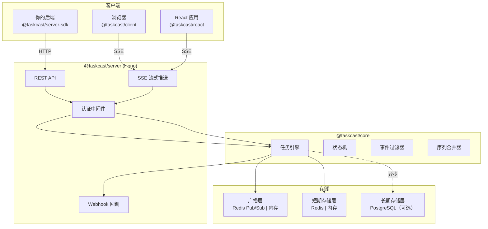
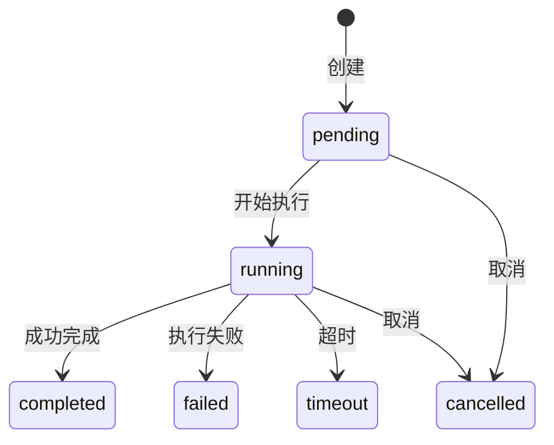

<div align="center">

# Taskcast

**为 LLM 流式输出、流式 Agent 等场景打造的统一长周期任务追踪与管理服务。**

[](https://www.npmjs.com/package/@taskcast/core)
[](./LICENSE)
[](https://www.typescriptlang.org/)
[](https://nodejs.org/)

[English](./README.md) | [中文](./README.zh.md)

</div>

---

传统的 SSE 连接在页面刷新后状态全部丢失，多个客户端也无法订阅同一个任务流。Taskcast 通过统一的任务追踪服务解决了这些问题，提供**持久化状态**、**可恢复的订阅**和**多客户端扇出** —— 专为大模型流式输出和 Agent 工作流设计。

## 核心亮点

- **可恢复的 SSE 流** — 通过事件 ID、过滤后索引或时间戳从任意位置重连，刷新页面不丢数据。
- **多客户端扇出** — 多个浏览器标签页、设备或服务可以同时订阅同一个任务的实时流。
- **序列消息合并** — 内置支持流式文本累加（`accumulate`）、取最新值替换（`latest`）和全量保留（`keep-all`）。
- **三层存储架构** — 广播层（Redis Pub/Sub）+ 短期存储层（Redis）+ 长期存储层（PostgreSQL），每层可插拔、可选配。
- **灵活的认证** — 无认证、JWT 或自定义中间件，权限粒度细化到单个任务。
- **SDK-First 架构** — 核心零 HTTP 依赖，可嵌入你现有的服务器，也可用 `npx taskcast` 独立运行。

## 架构



### 部署模式

**嵌入模式** — 将核心引擎导入并将 Hono 路由挂载到你的服务器中：

```
你的服务器 → @taskcast/core + 适配器 → @taskcast/server（Hono 路由）
```

**远程模式** — 作为独立服务运行，通过 HTTP SDK 连接：

```
你的服务器 → @taskcast/server-sdk → 独立 taskcast 服务 ← @taskcast/client（浏览器）
```

## 快速开始

### 独立服务器

```bash
npx taskcast
```

默认在 `3721` 端口启动。通过配置文件或环境变量进行配置：

```bash
npx taskcast -p 8080 -c taskcast.config.yaml
```

### 嵌入模式

```bash
pnpm add @taskcast/core @taskcast/server
```

```typescript
import { TaskEngine, MemoryBroadcastProvider, MemoryShortTermStore } from '@taskcast/core'
import { createTaskcastApp } from '@taskcast/server'

const engine = new TaskEngine({
  broadcast: new MemoryBroadcastProvider(),
  shortTermStore: new MemoryShortTermStore(),
})

const app = createTaskcastApp({ engine })
// 挂载到你现有的 Hono 应用或直接启动
export default app
```

## 使用示例

### 创建和追踪任务（服务端）

```typescript
// 创建任务
const task = await engine.createTask({
  type: 'llm.chat',
  params: { prompt: '给我讲个故事' },
  ttl: 3600,
})

// 转换到运行状态
await engine.transitionTask(task.id, 'running')

// 发布流式事件
await engine.publishEvent(task.id, {
  type: 'llm.delta',
  level: 'info',
  data: { text: '从前有座山...' },
  seriesId: 'response',
  seriesMode: 'accumulate',
})

// 完成任务
await engine.transitionTask(task.id, 'completed', {
  result: { output: '从前有座山... 完。' },
})
```

### 浏览器端订阅

```typescript
import { TaskcastClient } from '@taskcast/client'

const client = new TaskcastClient({
  baseUrl: 'http://localhost:3721',
  token: 'your-jwt-token', // 可选
})

await client.subscribe(taskId, {
  filter: {
    types: ['llm.*'],
    since: { index: 0 },
  },
  onEvent: (envelope) => {
    console.log(envelope.data) // { text: "从前有座山..." }
  },
  onDone: (reason) => {
    console.log(`任务 ${reason}`) // "任务 completed"
  },
})
```

### React 集成

```typescript
import { useTaskEvents } from '@taskcast/react'

function TaskStream({ taskId }: { taskId: string }) {
  const { events, isDone, doneReason, error } = useTaskEvents(taskId, {
    baseUrl: 'http://localhost:3721',
    filter: { types: ['llm.*'] },
  })

  return (
    <div>
      {events.map((e) => (
        <span key={e.eventId}>{e.data.text}</span>
      ))}
      {isDone && <p>已完成：{doneReason}</p>}
      {error && <p>错误：{error.message}</p>}
    </div>
  )
}
```

## 包一览

| 包 | 说明 | 安装 |
|---|------|------|
| [`@taskcast/core`](./packages/core) | 任务引擎 — 状态机、过滤、序列合并，零 HTTP 依赖 | `pnpm add @taskcast/core` |
| [`@taskcast/server`](./packages/server) | Hono HTTP 服务器 — REST、SSE、认证、Webhook | `pnpm add @taskcast/server` |
| [`@taskcast/server-sdk`](./packages/server-sdk) | 远程模式 HTTP 客户端 SDK | `pnpm add @taskcast/server-sdk` |
| [`@taskcast/client`](./packages/client) | 浏览器 SSE 订阅客户端 | `pnpm add @taskcast/client` |
| [`@taskcast/react`](./packages/react) | React Hooks（`useTaskEvents`） | `pnpm add @taskcast/react` |
| [`@taskcast/cli`](./packages/cli) | 独立服务器 CLI | `npx taskcast` |
| [`@taskcast/redis`](./packages/redis) | Redis 适配器（广播层 + 短期存储层） | `pnpm add @taskcast/redis` |
| [`@taskcast/postgres`](./packages/postgres) | PostgreSQL 适配器（长期存储层） | `pnpm add @taskcast/postgres` |
| [`@taskcast/sentry`](./packages/sentry) | Sentry 错误监控 Hooks | `pnpm add @taskcast/sentry` |

## 配置

### 配置文件

Taskcast 按以下优先级在当前目录搜索配置文件：

`taskcast.config.ts` > `.js` > `.mjs` > `.yaml` / `.yml` > `.json`

```yaml
# taskcast.config.yaml
port: 3721
logLevel: info

auth:
  mode: jwt
  jwt:
    algorithm: RS256
    publicKeyFile: /run/secrets/jwt.pub

adapters:
  broadcast:
    provider: redis
    url: ${REDIS_URL}
  shortTerm:
    provider: redis
    url: ${REDIS_URL}
  longTerm:
    provider: postgres
    url: ${DATABASE_URL}

sentry:
  dsn: ${SENTRY_DSN}
  captureTaskFailures: true
  captureTaskTimeouts: true

webhook:
  defaultRetry:
    retries: 3
    backoff: exponential
    initialDelayMs: 1000

cleanup:
  rules:
    - match:
        taskTypes: ["llm.*"]
      trigger:
        afterMs: 3600000
      target: events
    - trigger:
        afterMs: 604800000
      target: all
```

### 环境变量

| 变量 | 说明 | 默认值 |
|------|------|--------|
| `TASKCAST_PORT` | 服务端口 | `3721` |
| `TASKCAST_AUTH_MODE` | `none` \| `jwt` \| `custom` | `none` |
| `TASKCAST_JWT_SECRET` | JWT HMAC 密钥 | — |
| `TASKCAST_JWT_PUBLIC_KEY_FILE` | JWT 公钥文件路径 | — |
| `TASKCAST_REDIS_URL` | Redis 连接 URL | — |
| `TASKCAST_POSTGRES_URL` | PostgreSQL 连接 URL | — |
| `TASKCAST_LOG_LEVEL` | `debug` \| `info` \| `warn` \| `error` | `info` |
| `SENTRY_DSN` | Sentry 错误追踪 DSN | — |

## API 概览

### REST 端点

| 方法 | 路径 | 说明 |
|------|------|------|
| `POST` | `/tasks` | 创建任务 |
| `GET` | `/tasks/:taskId` | 查询任务状态与元数据 |
| `PATCH` | `/tasks/:taskId/status` | 更新任务状态 |
| `DELETE` | `/tasks/:taskId` | 删除任务 |
| `POST` | `/tasks/:taskId/events` | 发布事件 |
| `GET` | `/tasks/:taskId/events` | SSE 订阅 |
| `GET` | `/tasks/:taskId/events/history` | 查询历史事件 |

### SSE 查询参数

| 参数 | 说明 | 示例 |
|------|------|------|
| `since.id` | 从指定事件 ID 之后恢复 | `since.id=01HXXX` |
| `since.index` | 从过滤后索引之后恢复 | `since.index=5` |
| `since.timestamp` | 从指定时间戳之后恢复 | `since.timestamp=1700000` |
| `types` | 过滤事件类型（支持通配符） | `types=llm.*,tool.call` |
| `levels` | 过滤事件等级 | `levels=info,warn` |
| `includeStatus` | 是否包含状态事件 | `includeStatus=true` |
| `wrap` | 是否包裹 envelope | `wrap=true` |

### 任务状态生命周期



### 权限范围

| Scope | 说明 |
|-------|------|
| `task:create` | 创建任务 |
| `task:manage` | 更改任务状态、删除任务 |
| `event:publish` | 向任务发布事件 |
| `event:subscribe` | 订阅任务 SSE 流 |
| `event:history` | 查询事件历史 |
| `webhook:create` | 创建 Webhook 配置 |
| `*` | 完全访问权限 |

## 开发

```bash
# 安装依赖
pnpm install

# 构建所有包
pnpm build

# 运行测试
pnpm test

# 监听模式运行测试
pnpm test:watch

# 运行测试并生成覆盖率报告
pnpm test:coverage

# 类型检查
pnpm lint
```

## 贡献

欢迎贡献！请随时提交 Issue 和 Pull Request。

1. Fork 本仓库
2. 创建你的特性分支（`git checkout -b feat/amazing-feature`）
3. 提交你的更改（`git commit -m 'feat: add amazing feature'`）
4. 推送到分支（`git push origin feat/amazing-feature`）
5. 发起 Pull Request

## 许可证

[MIT](./LICENSE)